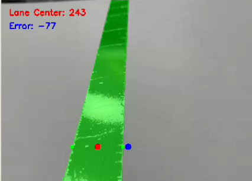
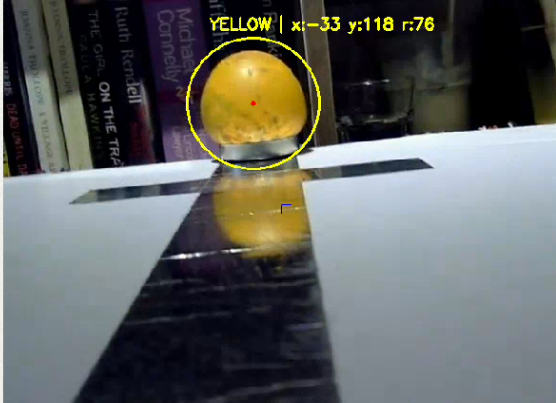
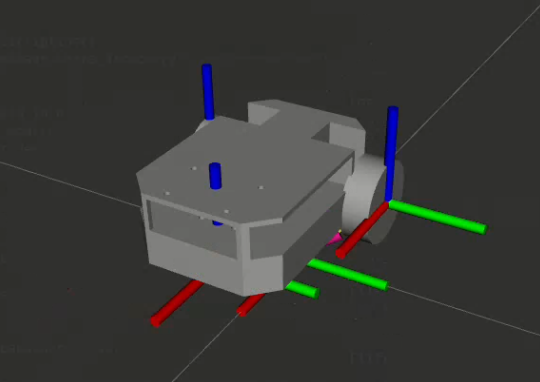

# ROS 2 Humble – Lane Following & Ball Grasping Mobile Robot

This project implements a **mobile robot** that can **follow a lane** and **detect / grasp a ball** using **ROS 2 Humble**. The system follows a classic robotics pipeline: perception → decision → actuation, combining **deep learning** and **traditional computer vision**, keeping things reliable and easy to debug.

---

## Features

* **Lane Following (Deep Learning)**

  * Lane segmentation using a deep learning model
  * Extracts lane center and computes lateral error
  * Designed for real-time navigation

* **Ball Detection (Classical CV)**

  * Color-based detection in **HSV color space**
  * Color thresholding + contour extraction
  * Ball selected as the **largest contour by area**

* **Simulation & Odometry**

  * Simulated odometry for mobile robot
  * URDF-based robot description
  * Full system simulation support

---

## System Architecture

```
sim_description
└── URDF + simulation launch
└── camera_reader
└── publishes /image/image_raw
├── lane_detect_node
│ └── Deep Learning Lane Segmentation
│
├── object_detection_node
│ └── HSV Color Threshold + Contour Detection
│
└── quad_odom
└── Simulated Odometry
```

All perception nodes subscribe to the same camera topic for synchronized processing.

---

## Nodes Overview

### Lane Detection Node

* **Purpose**: Detect and segment the lane for robot navigation
* **Method**: Deep Learning–based semantic segmentation
* **Input Topic**:

  * `/image/image_raw`
* **Output**:

  * Lane mask
  * Lane center position
  * Lateral error for control
  
<p align="center">
  
</p>
**Run command:**

```
ros2 run lane_detect lane_detect_node.py
```

---

### Ball Detection Node

* **Purpose**: Detect a ball for grasping

* **Method**:

  1. Convert RGB image → HSV
  2. Apply color thresholding
  3. Find contours
  4. Select the contour with the **largest area** as the ball

* **Input Topic**:

  * `/image/image_raw`

* **Output**:

  * Ball position in image frame
  * Visualized detection (circle / center point)

<p align="center">
  
</p>

**Run command:**

```
ros2 run object_detection object_detection_node.py
```

### Odometry Node (quad_odom)

* **Purpose**: Provide simulated odometry for the mobile robot
* **Type**: Simulation-based odom publisher

**Run command:**
```
ros2 run quad_odom odom_node.py
```
---

### Simulation (sim_description)

* **Purpose**: Display and simulate the robot model
* **Includes**:
  * URDF robot description
  * Visualization for testing perception and odometry

<p align="center">
  
  
</p>

**Run command:**
```
ros2 launch sim_description display.launch.py
```
### Bringup Node

* **Purpose**: Launch the entire robot system at once
* **Includes**:

  * Camera reader
  * Lane detection
  * Ball detection
  * Simulation
  * Odometry

**Run command:**

```
ros2 launch bringup system.launch.py
```
